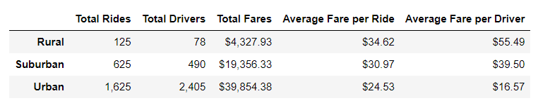
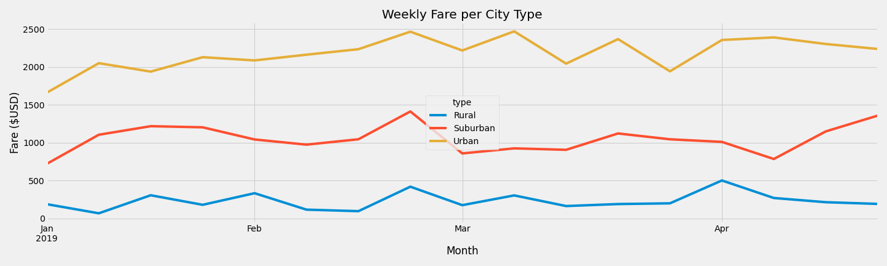

# PyBer_Analysis
## Overview
PyBer is a ride-sharing app company. They have gathered their data and would like to analyze it to help improve access to ride-sharing services and determine affordability for underserved neighborhoods.

---

## Purpose
To create a summary table of the ride-sharing data by city and plot a graph showing the total weekly fares for each city type.

---

## Results & Analysis
Using images from the summary DataFrame and multiple-line chart, describe the differences in ride-sharing data among the different city types.

The data provided can be found here: [Ride share data](Resources/ride_data.csv) and [City data](Resources/city_data.csv).

To create the summary table, the two datasets provided were merged together. Once merged, the required parameters were pulled and then used for calculation before entering the results into a new dataframe. From here, it is easy to see that urban cities have a higher volume of total rides (1,625) and drivers (2,405), which translates into higher total fares ($39,854.38) but lower average fares per ride ($24.53) and per driver ($16.57). There are thirty times less drivers in rural cities (78) and thirteen times less total rides (125) with a fares totalling $4,327.93. We see that the average fare per ride ($34.62) and per driver ($55.49) are the highest among the city types. Suburban city ride-share statistics sit in the middle of Rural and Urban cities with 625 total rides, 490 total drivers, and $19,356.33 total fares. Suburban cities have $30.97 average fare per ride and $39.50 per driver.  

It should be noted however that the data provided does not show the length of the ride. This may account for the large difference between rural and urban cities.

To visualize the weekly fare by city type, the merged dataset was used once again to group the rides by city type and date. The total fare was then calculated for each date and added to a new table. This table was pivoted to obtain a table with city types as the columns. A snapshot of the data from January 2019 to April 2019 was taken and resampledto provide weekly fares. This new table was plotted into the below line chart to visualize the weekly fares by city type from January to April.

In this line chart, we can see that the weekly fares for urban cities is higher than for suburban and rural cities. 

---

## Summary Analysis

Based on the results, provide three business recommendations to the CEO for addressing any disparities among the city types. 